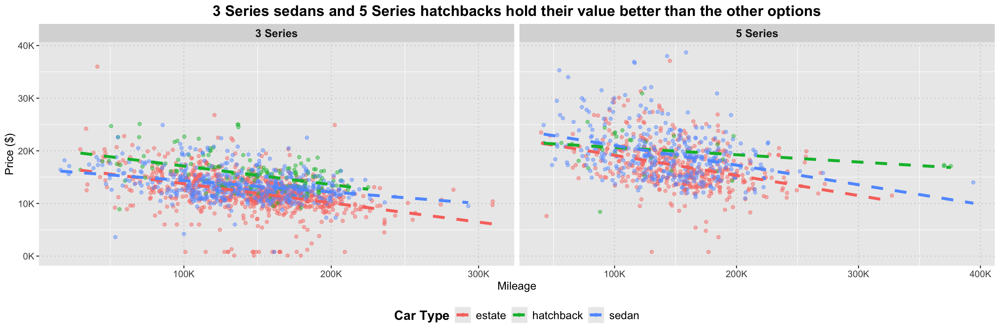

## Importing libraries


::: {.cell}

```{.r .cell-code}
library(reticulate)
library(dplyr)
library(lubridate)
library(stringr)
library(ggplot2)
library(scales)
library(pander)
reticulate::py_require("kagglehub")
```
:::


## Loading datasets


::: {.cell}

```{.r .cell-code}
reticulate::py_install("kagglehub")
```

::: {.cell-output .cell-output-stdout}

```
Using Python: /Library/Frameworks/Python.framework/Versions/3.12/bin/python3.12
Creating virtual environment '~/.virtualenvs/r-reticulate' ... 
```


:::

::: {.cell-output .cell-output-stdout}

```
Done!
Installing packages: pip, wheel, setuptools
```


:::

::: {.cell-output .cell-output-stdout}

```
Virtual environment '~/.virtualenvs/r-reticulate' successfully created.
Using virtual environment '~/.virtualenvs/r-reticulate' ...
```


:::

```{.r .cell-code}
py_run_string("
import kagglehub
path = kagglehub.dataset_download('avikumart/bmwcsv')
path1 = kagglehub.dataset_download('danielkyrka/bmw-pricing-challenge')")

dataset_path <- py$path
dataset_path1 <- py$path1

bmw_models <- read.csv(file.path(dataset_path, 'bmw.csv')) %>% mutate(model = trimws(model))
bmw_sales <- read.csv(file.path(dataset_path1, 'bmw_pricing_challenge.csv')) %>% select(-maker_key, -matches("^feature_[1-8]$"))
```
:::


## Wrangling 

Both dataset have some similar fields, so I had to do some changes in order to combine them. Specially in the "model_key" column of the second dataset.


::: {.cell}

```{.r .cell-code}
bmw_sales_edited <- bmw_sales %>% 
  mutate(year = str_sub(registration_date, 1, 4),
    model = ifelse(
      grepl("^[0-9]", model_key),  # If the model starts with a digit
      paste0(substr(model_key, 1, 1), " Series"),
      
      ifelse(
        grepl("^M", model_key) & nchar(model_key) > 2,  # If the model starts with "M" and is longer than 2 characters
        paste0(substr(model_key, 2, 2), " Series"),  # Skip the "M" and take the first digit
        
        ifelse(
          grepl("^M", model_key),  # If the model starts with "M" but is 2 characters or less (e.g., "M3", "M4")
          model_key,  # Keep "M3", "M4", etc. unchanged
          
          sub(" .*", "", model_key)  # Otherwise, take the first word
        )))) %>% rename(fuelType = fuel) %>% select(-registration_date)
```
:::


I combined the two BMW datasets by binding their rows after ensuring that the year column had the same data type (character). I also standardized the fuelType variable by converting all values to lowercase and consolidating equivalent categories.


::: {.cell}

```{.r .cell-code}
bmw_models$year <- as.character(bmw_models$year) 
bmw_sales_edited$year <- as.character(bmw_sales_edited$year)

combined_data <- bind_rows(bmw_models, bmw_sales_edited) %>% mutate(fuelType = tolower(fuelType),  # First, convert to lowercase
         fuelType = case_when(
           fuelType %in% c("electro", "electric") ~ "electric",
           fuelType %in% c("hybrid", "hybrid_petrol") ~ "hybrid",
           fuelType %in% c("petrol") ~ "petrol",
           fuelType %in% c("diesel") ~ "diesel",
           TRUE ~ fuelType  # keep other values as-is
         ))
```
:::


## Visualization


::: {.cell}

```{.r .cell-code}
table(combined_data$fuelType, combined_data$model)
```

::: {.cell-output .cell-output-stdout}

```
          
           1 Series 2 Series 3 Series 4 Series 5 Series 6 Series 7 Series
  diesel       1638      587     3494      777     1923      113      132
  electric        0        0        0        0        0        0        0
  hybrid          0       36       91        0       91        0        3
  other           0        3       21        0        1        0        0
  petrol        895      657      637      321      192       26       25
          
           8 Series ActiveHybrid   i3   i8   M2   M3   M4   M5   M6   X1   X2
  diesel         17            0    0    0    0    0    0    0    0  903  147
  electric        0            0    6    0    0    0    0    0    0    0    0
  hybrid          0            1   36   17    0    0    0    0    0    0    0
  other           0            0    7    1    0    0    0    0    0    0    0
  petrol         22            0    0    0   21   34  127   30    8  176  141
          
             X3   X4   X5   X6   X7   Z3   Z4
  diesel    898  201  654  135   49    0    0
  electric    0    0    0    0    0    0    0
  hybrid      6    0   24    1    0    0    0
  other       0    0    3    0    0    0    0
  petrol     85   24   38   22    6    7  114
```


:::
:::


Since only Series 1 to 5 have a significant number of records and include a variety of fuel types, I selected them for the following visualization:


::: {.cell}

```{.r .cell-code}
model_comparison <- combined_data %>% filter(mileage <600000, model %in% c("1 Series","2 Series", "3 Series", "4 Series", "5 Series"), fuelType!= "other")


# Compute the predicted values for each fuelType and model
library(dplyr)

regression_lines <- model_comparison %>%
  group_by(model, fuelType) %>%
  do({
    fit <- lm(price ~ mileage, data = .)
    data.frame(
      mileage = seq(min(.$mileage), max(.$mileage), length.out = 100),
      price = predict(fit, newdata = data.frame(mileage = seq(min(.$mileage), max(.$mileage), length.out = 100))),
      model = unique(.$model),
      fuelType = unique(.$fuelType)
    )
  })

# Add black dot lines
ggplot(model_comparison, aes(x = mileage, y = price, color = fuelType)) +
  geom_point(data = regression_lines, aes(x = mileage, y = price), color = "black", size = 1.2, shape = 16,alpha = 0.4,  inherit.aes = FALSE) +
  geom_point(alpha = 0.35) + 
  geom_smooth(method = "lm", se = FALSE, linetype = "dashed", size = 1.5) +

  facet_wrap(~ model, nrow = 1, scales = "free_x") +
  labs(
    title = "Diesel BMWs Maintain Value More Consistently as Mileage Increases Compared to Petrol",
    x = "Mileage",
    y = "Price ($)",
    color = "Fuel Type"
  ) +
  scale_x_continuous(labels = label_number(scale = 1/1000, suffix = "K")) +
  scale_y_continuous(labels = label_number(scale = 1/1000, suffix = "K"), limits = c(0, 50000)) +
  theme(
    strip.text = element_text(size = 12, face = "bold"),
    plot.title = element_text(size = 16, face = "bold", hjust = 0.1),
    axis.title = element_text(size = 12),
    axis.text = element_text(size = 10),
    legend.position = "bottom",
    legend.title = element_text(face = "bold", size =20),
    legend.text = element_text(size = 15),
    legend.key.size = unit(1.2, "lines"),
    panel.grid.major = element_line(color = "grey80", linetype = "dotted")
  ) 
```

::: {.cell-output-display}
{width=1440}
:::
:::


If you're a car and BMW enthusiast who’s also financially responsible, the chart above can guide you in choosing the best fuel type for your next BMW. Among the 1–5 Series models, those with diesel engines consistently preserve their value much better than their petrol counterparts. As for hybrid models, there's no consistent pattern across the three series (2,3,5) that offer this option. Interestingly, the Series 2 hybrids show a depreciation trend similar to the diesel versions, making them a solid choice—especially if the 2 Series chassis is your thing. On the other hand, the Series 3 and 5 hybrids performed the worst, even below the petrol versions. 


::: {.cell}

```{.r .cell-code}
table(bmw_sales_edited$car_type,bmw_sales_edited$model)
```

::: {.cell-output .cell-output-stdout}

```
             
              1 Series 2 Series 3 Series 4 Series 5 Series 6 Series 7 Series
  convertible        9        6       13        9        0        2        0
  coupe              5       10       27       44        0       12        0
  estate             2        0      995        0      607        0        0
  hatchback        422        0      175       44       44        8        1
  sedan             13        0      585        6      498        9       53
  subcompact       113        0        3        0        0        0        0
  suv                0        0        0        0        1        0        0
  van                0       38        2        0        1        0        0
             
              ActiveHybrid  i3  i8  M3  M4  M5  X1  X3  X4  X5  X6  Z4
  convertible            0   0   0   1   1   0   0   0   0   0   0   6
  coupe                  0   0   1   4   1   0   0   0   0   0   0   0
  estate                 0   0   0   0   0   0   0   2   0   0   0   0
  hatchback              0   5   0   0   0   0   0   0   0   0   0   0
  sedan                  1   0   0   2   0   1   0   0   0   0   0   0
  subcompact             0   1   0   0   0   0   0   0   0   0   0   0
  suv                    0   0   0   0   0   0 274 434  46 251  52   0
  van                    0   0   0   0   0   0   1   2   0   0   0   0
```


:::
:::

::: {.cell}

```{.r .cell-code}
bmw_sales_edited1 <- bmw_sales_edited %>% filter(year %in% c("2012","2013","2014"), car_type %in% c("estate","sedan","hatchback"),
                                                 model %in% c("3 Series","5 Series"))

ggplot(bmw_sales_edited1, aes(x = mileage, y = price, color = car_type)) +
  geom_point(alpha = 0.45) + 
  geom_smooth(method = "lm", se = FALSE, linetype = "dashed", size=1.5) +
  facet_wrap(~ model, nrow = 1, scales = "free_x") +
  labs(
    title = "3 Series sedans and 5 Series hatchbacks hold their value better than the other options",
    x = "Mileage",
    y = "Price ($)",
    color = "Car Type"
  ) +
  scale_x_continuous(labels = scales::label_number(scale = 1/1000, suffix = "K")) +
  scale_y_continuous(labels = scales::label_number(scale = 1/1000, suffix = "K")) +
  theme(
    strip.text = element_text(size = 12, face = "bold"),  # Facet labels
    plot.title = element_text(size = 16, face = "bold", hjust = 0.5),  # Title formatting
    axis.title = element_text(size = 12),  # Axis titles size
    axis.text = element_text(size = 10),  # Axis labels size
    legend.position = "bottom",  # Move legend to the bottom
    legend.title = element_text(face = "bold", size = 14),  # Legend title size
    legend.text = element_text(size = 12),  # Legend text size
    legend.key.size = unit(1.2, "lines"),  # Adjust legend key size
    panel.grid.major = element_line(color = "grey80", linetype = "dotted")  # Grid lines
  )
```

::: {.cell-output-display}
{width=1440}
:::
:::


-As expected, the Series 3 sedan holds its value much better than the station wagon and hatchback options. This makes sense, as it's arguably the best-looking Series 3 variant and also very popular.

-For the Series 5, the hatchback is the best option financially. It outperforms both the station wagon and sedan, which show very similar depreciation trends. This model has a unique style that doesn’t look like a typical hatchback and is well known as the Gran Turismo version.


