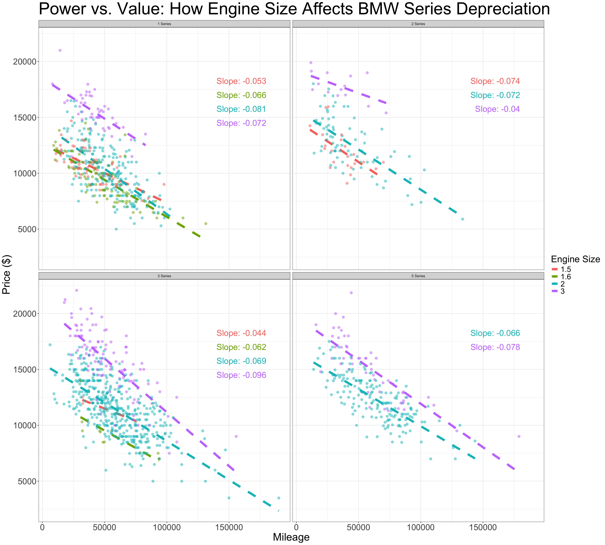
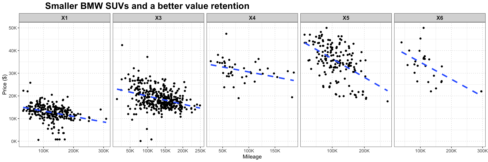
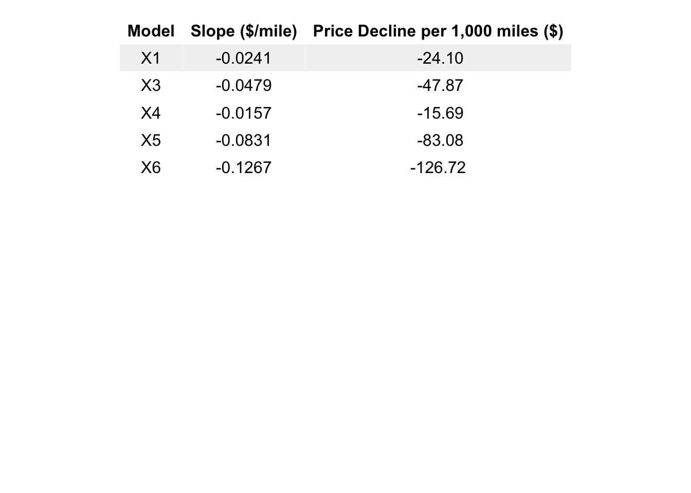

In this project, I aim to answer two questions that are personally meaningful to me:

1. Performance & Value Retention (compact)
- If I want a compact BMW, with decent horsepower, and also retains its value well as mileage increases, which series should I consider buying?

2. Family-Friendly & Durable (SUV)
- If I’m looking for a family-friendly BMW SUV, which model best retains its value over mileage?

These questions combine both emotional and financial aspects of car ownership, helping identify models that deliver lasting performance, practicality, and investment value.

## Importing libraries


::: {.cell}

```{.r .cell-code}
library(reticulate)
library(dplyr)
library(lubridate)
library(stringr)
library(ggplot2)
library(scales)
library(pander)
library(broom)
library(gridExtra)
library(grid)
```
:::


## Loading datasets

I got these 2 datasets from kaggle. I used reticulate and a python script to get the URLs, then used the paths to download the datasets. Both are sales of used bmw with columns like model, fuel type, car type, mpg, price, year, etc.


::: {.cell}

```{.r .cell-code}
py_run_string("import kagglehub
path = kagglehub.dataset_download('avikumart/bmwcsv')
path1 = kagglehub.dataset_download('danielkyrka/bmw-pricing-challenge')")
```

::: {.cell-output .cell-output-stdout}

```
Warning: Looks like you're using an outdated `kagglehub` version (installed: 0.3.11), please consider upgrading to the latest version (0.3.12).
Warning: Looks like you're using an outdated `kagglehub` version (installed: 0.3.11), please consider upgrading to the latest version (0.3.12).
```


:::

```{.r .cell-code}
dataset_path <- py$path
dataset_path1 <- py$path1

bmw_models <- read.csv(file.path(dataset_path, 'bmw.csv')) %>% mutate(model = trimws(model))
bmw_sales <- read.csv(file.path(dataset_path1, 'bmw_pricing_challenge.csv')) %>% select(-maker_key, -matches("^feature_[1-8]$"))  #deleted the features since there was no explanation of their meaning
```
:::


## 1. Performance & Value Retention (compact)


::: {.cell}

```{.r .cell-code}
head(bmw_models,20)
```

::: {.cell-output-display}

`````{=html}
<div data-pagedtable="false">
  <script data-pagedtable-source type="application/json">
{"columns":[{"label":[""],"name":["_rn_"],"type":[""],"align":["left"]},{"label":["model"],"name":[1],"type":["chr"],"align":["left"]},{"label":["year"],"name":[2],"type":["int"],"align":["right"]},{"label":["price"],"name":[3],"type":["int"],"align":["right"]},{"label":["transmission"],"name":[4],"type":["chr"],"align":["left"]},{"label":["mileage"],"name":[5],"type":["int"],"align":["right"]},{"label":["fuelType"],"name":[6],"type":["chr"],"align":["left"]},{"label":["tax"],"name":[7],"type":["int"],"align":["right"]},{"label":["mpg"],"name":[8],"type":["dbl"],"align":["right"]},{"label":["engineSize"],"name":[9],"type":["dbl"],"align":["right"]}],"data":[{"1":"5 Series","2":"2014","3":"11200","4":"Automatic","5":"67068","6":"Diesel","7":"125","8":"57.6","9":"2.0","_rn_":"1"},{"1":"6 Series","2":"2018","3":"27000","4":"Automatic","5":"14827","6":"Petrol","7":"145","8":"42.8","9":"2.0","_rn_":"2"},{"1":"5 Series","2":"2016","3":"16000","4":"Automatic","5":"62794","6":"Diesel","7":"160","8":"51.4","9":"3.0","_rn_":"3"},{"1":"1 Series","2":"2017","3":"12750","4":"Automatic","5":"26676","6":"Diesel","7":"145","8":"72.4","9":"1.5","_rn_":"4"},{"1":"7 Series","2":"2014","3":"14500","4":"Automatic","5":"39554","6":"Diesel","7":"160","8":"50.4","9":"3.0","_rn_":"5"},{"1":"5 Series","2":"2016","3":"14900","4":"Automatic","5":"35309","6":"Diesel","7":"125","8":"60.1","9":"2.0","_rn_":"6"},{"1":"5 Series","2":"2017","3":"16000","4":"Automatic","5":"38538","6":"Diesel","7":"125","8":"60.1","9":"2.0","_rn_":"7"},{"1":"2 Series","2":"2018","3":"16250","4":"Manual","5":"10401","6":"Petrol","7":"145","8":"52.3","9":"1.5","_rn_":"8"},{"1":"4 Series","2":"2017","3":"14250","4":"Manual","5":"42668","6":"Diesel","7":"30","8":"62.8","9":"2.0","_rn_":"9"},{"1":"5 Series","2":"2016","3":"14250","4":"Automatic","5":"36099","6":"Diesel","7":"20","8":"68.9","9":"2.0","_rn_":"10"},{"1":"X3","2":"2017","3":"15500","4":"Manual","5":"74907","6":"Diesel","7":"145","8":"52.3","9":"2.0","_rn_":"11"},{"1":"1 Series","2":"2017","3":"11800","4":"Manual","5":"29840","6":"Diesel","7":"20","8":"68.9","9":"2.0","_rn_":"12"},{"1":"X3","2":"2016","3":"15500","4":"Automatic","5":"77823","6":"Diesel","7":"125","8":"54.3","9":"2.0","_rn_":"13"},{"1":"2 Series","2":"2015","3":"10500","4":"Manual","5":"31469","6":"Diesel","7":"20","8":"68.9","9":"2.0","_rn_":"14"},{"1":"X3","2":"2017","3":"22000","4":"Automatic","5":"19057","6":"Diesel","7":"145","8":"54.3","9":"2.0","_rn_":"15"},{"1":"3 Series","2":"2017","3":"16500","4":"Manual","5":"16570","6":"Diesel","7":"125","8":"58.9","9":"2.0","_rn_":"16"},{"1":"3 Series","2":"2017","3":"14250","4":"Automatic","5":"55594","6":"Other","7":"135","8":"148.7","9":"2.0","_rn_":"17"},{"1":"3 Series","2":"2017","3":"16000","4":"Automatic","5":"45456","6":"Diesel","7":"30","8":"64.2","9":"2.0","_rn_":"18"},{"1":"1 Series","2":"2017","3":"15500","4":"Automatic","5":"22812","6":"Diesel","7":"20","8":"68.9","9":"1.5","_rn_":"19"},{"1":"4 Series","2":"2014","3":"14000","4":"Automatic","5":"47348","6":"Diesel","7":"125","8":"60.1","9":"2.0","_rn_":"20"}],"options":{"columns":{"min":{},"max":[10]},"rows":{"min":[10],"max":[10]},"pages":{}}}
  </script>
</div>
`````

:::
:::


Before plotting, I narrowed down the dataset to include only BMW 1, 2, 3, and 5 Series models manufactured between 2011 and 2015. To keep the comparison fair. I also excluded vehicles priced over $50,000 and those with missing or invalid engine size values.


::: {.cell}

```{.r .cell-code}
bmw_models_edited <- bmw_models %>% filter(model %in% c("1 Series","2 Series", "3 Series", "5 Series"), year >2010 & year<2016, price <50000, engineSize>0 )
```
:::


I got separate linear regression models for each combination of BMW model series and engine size to examine how mileage impacts price. From these models, I extracted the slope and intercept values to understand price depreciation patterns.


::: {.cell}

```{.r .cell-code}
# Calculate regression lines and slopes
regression_data <- bmw_models_edited %>%
  group_by(model, engineSize) %>%
  do({
    model <- lm(price ~ mileage, data = .)
    data.frame(
      slope = coef(model)[2],
      intercept = coef(model)[1])})
```
:::


To prepare for labeling these lines in a plot, I created fixed x-positions and variable y-positions to place the labels without overlapping.


::: {.cell}

```{.r .cell-code}
# Set fixed positions with different Y values to avoid overlap
label_positions <- regression_data %>%
  group_by(model) %>%
  mutate(
    x_pos = 180000, 
    y_pos = 18000 - (row_number() - 1) * 1250)
```
:::

::: {.cell}

```{.r .cell-code}
ggplot(bmw_models_edited, aes(x = mileage, y = price, color = as.factor(engineSize))) +
  geom_smooth(method = "lm", se = FALSE, linetype = "dashed", size = 2.5) +
  geom_point(alpha = 0.50,size = 2.5) +
  geom_text(
    data = label_positions,
    aes(
      x = x_pos, 
      y = y_pos, 
      label = paste0("Slope: ", round(slope, 3)),
      color = as.factor(engineSize)),
    hjust = 1,
    vjust = 0,  
    show.legend = FALSE,
    size=7
    
  ) +
  facet_wrap(~model) +
  theme_bw() +
  labs(
    color = "Engine Size",
    title = "Power vs. Value: How Engine Size Affects BMW Series Depreciation",
    x = "Mileage",
    y = "Price ($)")+
theme(
    plot.title = element_text(size = 40),  
    axis.title = element_text(size = 25),
    axis.text = element_text(size = 20),  
    legend.title = element_text(size= 22),
    legend.text = element_text(size = 18),
    
)
```

::: {.cell-output-display}
{width=1920}
:::
:::


The 2 Series equipped with the larger 3.0 liter engine demonstrates exceptional value retention compared to other models. Meanwhile, the 1 Series, 3 Series, and 5 Series tend to maintain their value better when fitted with the smallest engine.

As a car enthusiast (especially bmw enthusiast), I've always considered the 2 Series to be the perfect middle ground for performance, between the 3 and 1 series. I'm confident to say that, performance oriented buyers, specifically look for 2 Series models with the biggest engine, creating a higher demand in the used market that supports their stronger value retention (3.0 L) compared to the 1.5 and 2.0 L options.


## 2. Family-Friendly & Durable (SUV)

First, I renamed the fuel column to fuelType for clarity, extracted the year from the registration_date column, and then removed the original date column.


::: {.cell}

```{.r .cell-code}
bmw_sales_edited <- bmw_sales %>% rename(fuelType = fuel) %>% mutate(year = str_sub(registration_date, 1, 4))  %>% select(-registration_date)
```
:::


Then, I filtered the dataset to include only SUV models and restricted the year range to a short window, minimizing price variations caused by different model generations.


::: {.cell}

```{.r .cell-code}
model_comparison <- bmw_sales_edited %>% filter(model_key %in% c("X1","X3","X4","X5","X6"), year>2010 & year<2016) 
```
:::


This following code analyzes how mileage impacts the price of different BMW SUVs. It fits a separate linear regression for each model to estimate the average price decline per mile driven. It then formats the results, gets the price drop per 1,000 miles, and categorizes the statistical significance of the relationship.


::: {.cell}

```{.r .cell-code}
# Calculate slopes for each model
slope_data <- model_comparison %>%
  group_by(model_key) %>% # Group the data by model
  do(tidy(lm(price ~ mileage, data = .))) %>% # Fit a linear model (price ~ mileage) for each model and return tidy output
  filter(term == "mileage") %>% # Keep only the row corresponding to the mileage coefficient (slope)
  select(model_key, slope = estimate, std_error = std.error, p_value = p.value) %>% # Select relevant columns and rename for clarity
  mutate(
    slope_formatted = round(slope, 4),  # Rounded slope
    price_decline_per_1000_miles = round(slope * 1000, 2),  # How much price drops per 1,000 miles

    # Add significance stars based on conventional p-value thresholds
    significance = case_when(
      p_value < 0.001 ~ "Highly significant", 
      p_value < 0.01  ~ "Moderately significant",   
      p_value < 0.05  ~ "Marginally significant",    
      TRUE ~ "Not significant"             
    )
  )
```
:::

::: {.cell}

```{.r .cell-code}
ggplot(model_comparison, aes(x = mileage, y = price)) +
  geom_point() + 
  geom_smooth(method = "lm", se = FALSE, linetype = "dashed", size = 1.5) +
  facet_wrap(~ model_key, nrow = 1, scales = "free_x") +
  labs(
    title = "Smaller BMW SUVs and a better value retention",
    x = "Mileage",
    y = "Price ($)",
    color = "Fuel Type"
  ) +
  scale_x_continuous(labels = label_number(scale = 1/1000, suffix = "K")) +
  scale_y_continuous(labels = label_number(scale = 1/1000, suffix = "K"), limits = c(0, 50000)) +
  theme_bw() +
  theme(
    strip.text = element_text(size = 12, face = "bold"),
    plot.title = element_text(size = 20, face = "bold", hjust = 0.1),
    axis.title = element_text(size = 12),
    axis.text = element_text(size = 10),
    legend.position = "bottom",
    legend.title = element_text(face = "bold", size = 20),
    legend.text = element_text(size = 15),
    legend.key.size = unit(1.2, "lines"),
    panel.grid.major = element_line(color = "grey80", linetype = "dotted")
  )
```

::: {.cell-output-display}
{width=1440}
:::
:::


From both the graph above and the slope table below, we can observe that smaller BMW SUV models tend to retain their value better over time.

- The X1 and X3, which are the most compact SUVs in the lineup, demonstrate strong value retention with relatively shallow depreciation slopes of -0.0241 and -0.0479, respectively.

- The X4, a mid-size SUV, shows the slowest depreciation overall, with a slope of -0.0157, showing it holds value very well relative to its mileage.

This suggests that the X4 offers the best balance between size, design, and resale value. In fact, in my opinion, the X4 not only provides good financial value but also features one of the best \looking designs between all BMW SUVs. It's a perfectly sized option, especially when compared to its larger version, the X6, which shares a similar coupe-style design but performs significantly worse in terms of depreciation.


::: {.cell}

```{.r .cell-code}
# Format table data
table_data <- slope_data %>%
  select(Model = model_key, 
         `Slope ($/mile)` = slope_formatted, 
         `Price Decline per 1,000 miles ($)` = price_decline_per_1000_miles)

# Function to create the table
create_slope_table <- function(data) {
  mytheme <- ttheme_minimal(
    core = list(
      fg_params = list(fontface = c(rep("plain", 1), rep("plain", nrow(data)))),
      bg_params = list(fill = c(rep("grey95", 1), rep("white", nrow(data))))
    ),
    colhead = list(fg_params = list(fontface = "bold", fontsize = 12)),
    rowhead = list(fg_params = list(fontface = "bold"))
  )
  
  tableGrob(data, rows = NULL, theme = mytheme)
}

slope_table <- create_slope_table(table_data)
grid.arrange(slope_table,
             vp = viewport(y = 0.8, height = 0.4)) 
```

::: {.cell-output-display}
{width=672}
:::
:::
